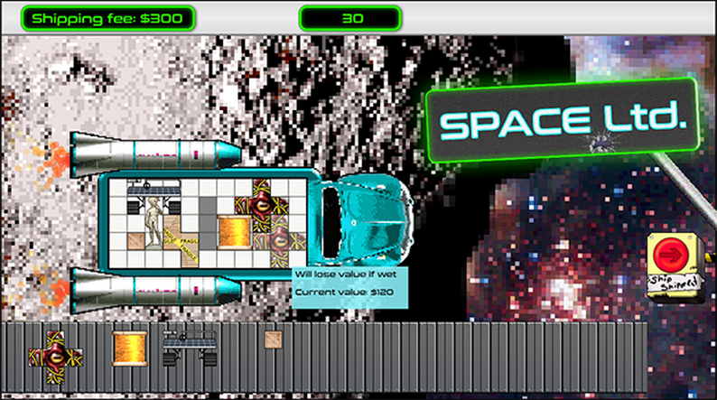
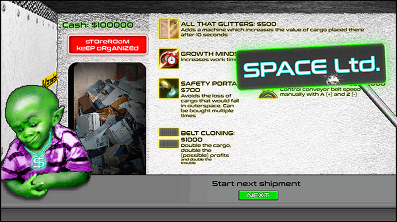

[JAVASCRIPT__BADGE]: https://img.shields.io/badge/Javascript-000?style=for-the-badge&logo=javascript
[KRITA__BADGE]: https://img.shields.io/badge/Krita-203759?style=for-the-badge&logo=krita&logoColor=EEF37B
[PHOTOSHOP__BADGE]: https://img.shields.io/badge/Adobe%20Photoshop-31A8FF?style=for-the-badge&logo=Adobe%20Photoshop&logoColor=black
[ITCHIO__BADGE]: https://img.shields.io/badge/Itch.io-FA5C5C?style=for-the-badge&logo=itchdotio&logoColor=white
[TRELLO__BADGE]: https://img.shields.io/badge/Trello-0052CC?style=for-the-badge&logo=trello&logoColor=white
[GIT__BADGE]: https://img.shields.io/badge/GIT-E44C30?style=for-the-badge&logo=git&logoColor=white

<div align='center'>
    
</div>
<a align="center" href="https://ldjam.com/events/ludum-dare/54">Ludum Dare 54 website</a>
<h1 align="center" style="font-weight: bold;">🚀 👨‍🚀 Limited Space 🌌 👾</h1>

[](https://img.shields.io/badge/Made_with-GDevelop-purple)
[](https://github.com/ellerbrock/open-source-badge/)
[](https://github.com/ellerbrock/open-source-badge/)
<br>

<div align='center'>

![javascript][JAVASCRIPT__BADGE]
![krita][KRITA__BADGE]
![photoshop][PHOTOSHOP__BADGE]
[![itch.io][ITCHIO__BADGE]](https://games-ever-made.itch.io/space-ltd)
![trello][TRELLO__BADGE]
![git][GIT__BADGE]

</div>

<p align="center">
 <a href="#about">About</a> • 
 <a href="#controls">Controls</a> • 
  <a href="#colab">Collaborators</a> •
 <a href="#references">References</a> •
 <a href="#aknowledges">Aknowledges</a> •
</p>

<p align="center">
    </img> |
    </img>
</p>

<h2 id="started">📌 About  </h2>

Jam entry made for Ludum Dare 54 in under 72 hours.

Programming, graphic assets and music by Andrew "Andruid", Felipe "Gilgadev" and Marcelo "Holy". Made in GDevelop 5.

You will work in an over exploiting highly motivating environment as space logistics underpaid collaborator in the leading galaxy express transportation company.

Every shipment is delivered with the utmost responsibility and covered by you. Yes, YOU! Space Ltd.'s Andromeda **Alpha Gama Plus Star Deluxe Ensurance™**.

Space Ltd. brings the universe closer to you.

<p>Visit our project, clicking on the button bellow</p>

[![itch.io][ITCHIO__BADGE]](https://games-ever-made.itch.io/space-ltd)

<br/>
<h2 id="controls">🕹️ Controls </h2>

Drag and drop cargo coming from the conveyor belt into the ship.

Rotate dragged cargo with 'Q' and 'E'

Don't drop it outside or over existing cargo, or you might damage it.

Water: damages cargo and lowers its value.
Heat: destroys wooden cargo.
Glue: you can’t move placed cargo.
Ship cargo to earn profit [hotkey 'S'].

Buy new upgrades at the shop.

<br/>

<h2 id="colab">🤝 Collaborators</h2>

Special thank you for all people that contributed for this project.

<table>
  <tr>
    <td align="center">
      <a href="https://github.com/andrew-mendes">
        <br>
        <sub>
          <b>Andrew Mendes</b><br/>
          <i>Developer</i>
        </sub>
      </a>
    </td>
    <td align="center">
      <a href="https://github.com/fgil90">
        <br>
        <sub>
          <b>Felipe Gil</b><br/>
          <i>Deveoloper</i>
        </sub>
      </a>
    </td>
    <td align="center">
      <a href="https://github.com/MarceloLMoreira">
        <br>
        <sub>
          <b>Marcelo 'Holysparks'</b><br/>
          <i>Developer</i>
        </sub>
      </a>
    </td>
  </tr>
</table>

<h2 id="aknowledges">Special tanks and Aknowledges</h2>

Here is our Special Thanks and Aknowledges for all of those who help us developing this project:

```cs
 {
    "plataform":"GDeveloper",
    "portal":"Itch.io",
 }
```


